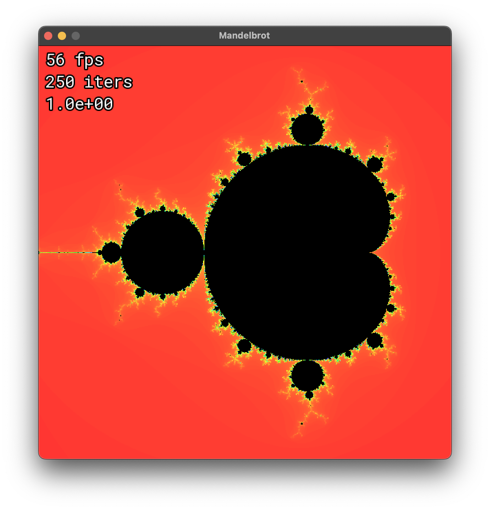
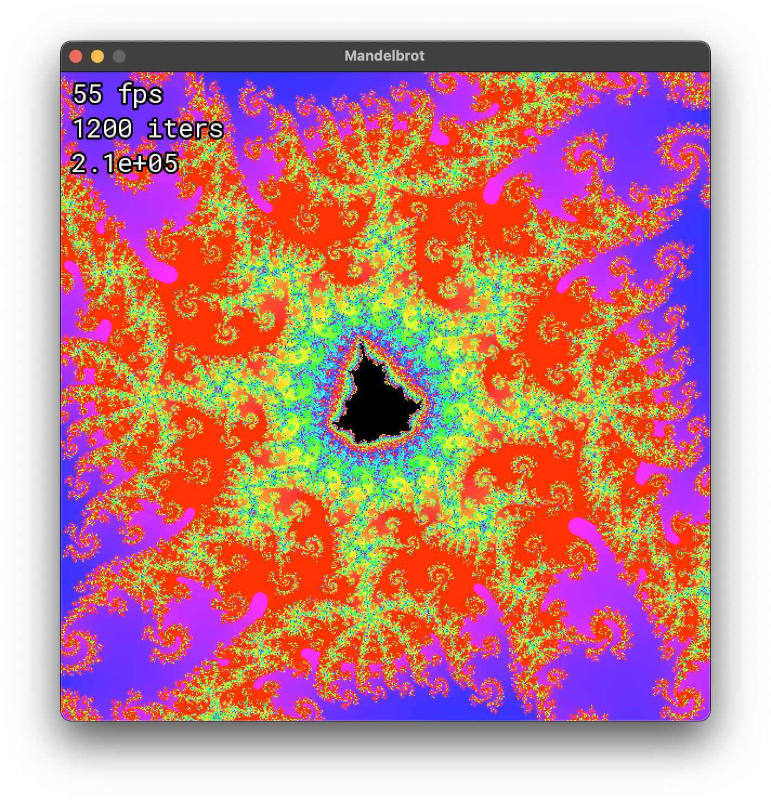

# mandelbrot

SFML-based Mandelbrot viewer program.

<p float="middle">
    
    
</p>

# Dependencies
 * CMake 3.16
 * C++17
 * SFML 2.5

# Building

```
cmake -B build -DCMAKE_BUILD_TYPE=Release
cmake --build build
```

# Controls

| Action      | Control         |
| ----------- | --------------- |
| Go to point | Click           |
| Zoom        | Scroll (or W/S) |
| Pan         | Arrow keys      |
| Reset view  | R               |
